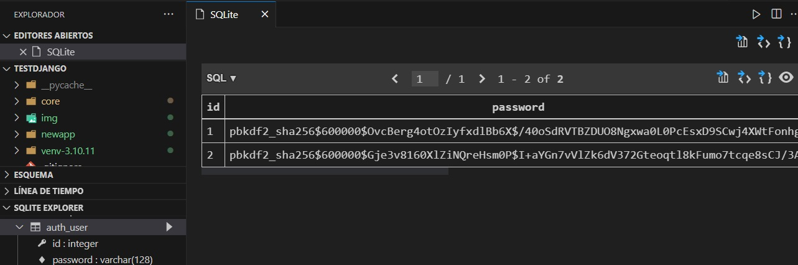

## 1.-Verifico la versión de Python

    python --version
    py --version

    Python 3.10.11

## 2.-Actualizo pip

**pip** es un administrador de paquetes para Python. Los paquetes son módulos de código que se pueden usar en Python. Los paquetes son geniales porque pueden ser compartidos con otros o reutilizados en otros proyectos. Puede instalar paquetes usando pip.

    python -m pip install --upgrade pip
## 2.1.-Verifico la versión de pip

    pip --version

    pip 23.1.2 from C:\Users\fernando\AppData\Local\Programs\Python\Python310\lib\site-packages\pip (python 3.10)

## 3.-Creo el entorno virtual con venv

 El módulo **venv** está incluido en la biblioteca estándar de Python, lo que significa que viene preinstalado con cualquier instalación de Python. Por lo tanto, no necesita instalar nada adicionalmente para utilizar el módulo venv. Puede utilizarlo directamente en su código Python o desde la línea de comandos.

 En mi notebook tengo instaladas las versiones de Python 3.10.11 y 3.8.8, por lo que puedo crear el entorno virtual con cualquiera de las dos versiones.

    C:\Users\fernando\AppData\Local\Programs\Python

Despues de instalar las versiones de Python en Windows, se crean las carpetas `Python310` y `Python38` en la ruta `C:\Users\fernando\AppData\Local\Programs\Python`.  

**IMPORTANTE**: Tengo que verificar las rutas de las variables de usuario `PATH` y de las variables de sistema `Path` para que apunten a la versión de Python que quiero utilizar.

    python -m venv venv
    py -m venv venv

Para crear el entorno con la version que quiero utilizar, ejecuto el siguiente comando:

    C:\Users\fernando\AppData\Local\Programs\Python\Python310\python.exe -m venv venv-3.10.11

    

## 4.-Activo el entorno virtual (venv)

    venv\Scripts\activate

Para activar un entorno especifico

    venv-3.10.11\Scripts\activate

## 4.1-Comandos para instalar y desinstalar paquetes

    pip install
    pip uninstall

## 5.-Instalo Django

Instalar Django después de activar el entorno virtual (venv), ya que de esta manera puede asegurarse de que se instale dentro del entorno virtual y no afecte a otros proyectos o a la instalación global de Python.

Después de activar el entorno virtual `venv`, puedes instalar Django utilizando `pip`. A continuación, se muestra el comando para instalar Django:

```bash
pip install django
```

Este comando instalará la última versión de Django en tu entorno virtual activo. Si deseas instalar una versión específica de Django, puedes especificar la versión junto con el nombre del paquete. Por ejemplo, para instalar Django 3.2, ejecuta:

```bash
pip install django==3.2
```

Una vez que Django esté instalado, podrás verificar la instalación y la versión ejecutando este comando:

```bash
python -m django --version
```

Esto mostrará la versión de Django instalada en tu entorno virtual activo [Source 2](https://roylans.dev/creando-un-entorno-virtual-para-django-framework).

## 5.1.-Comando pip list

    pip list

    Package    Version
    ---------- -------
    asgiref    3.6.0
    Django     4.2.1
    pip        23.1.2
    setuptools 65.5.0
    sqlparse   0.4.4
    tzdata     2023.3

**pip list** es un comando que muestra la lista de paquetes instalados en el entorno virtual activo. Este comando es útil para verificar qué paquetes están instalados en tu entorno de desarrollo, lo que te permite identificar posibles dependencias faltantes o innecesarias.

## 6.-Ejecutar pip freeze > requirements.txt

El comando pip freeze > requirements.txt se utiliza para guardar las dependencias de tu proyecto en un archivo llamado requirements.txt. Es una buena práctica ejecutar este comando después de instalar todas las dependencias iniciales de tu proyecto y cada vez que agregues, actualices o elimines una dependencia.

    pip freeze > requirements.txt

Se crea el archivo `requirements.txt` con las dependencias del proyecto.

    asgiref==3.6.0
    Django==4.2.1
    sqlparse==0.4.4
    tzdata==2023.3

## 6.1.-Ejecutar pip install -r requirements.txt (20)

El comando pip install -r requirements.txt se utiliza para instalar todas las dependencias de tu proyecto desde el archivo requirements.txt. Es una buena práctica ejecutar este comando después de clonar un proyecto de un repositorio remoto o después de crear un nuevo entorno virtual para tu proyecto.

    (venv) pip install -r requirements.txt

## 7.-Crear un proyecto Django

    django-admin startproject core .

Me crea la carpeta `core` con los archivos necesarios para iniciar el proyecto, y la estructura de carpetas y archivos es la siguiente:

    manage.py
    core
    __init__.py
    asgi.py
    settings.py
    urls.py
    wsgi.py

## 8.-Ejecutar el servidor de desarrollo

    py manage.py runserver

Para cerrar el servidor de desarrollo, presiona

    ctrl + c

## 9.-Crear una aplicación

    py manage.py startapp newapp

Me crea la carpeta `newapp` con los archivos necesarios para iniciar la aplicación, y la estructura de carpetas y archivos es la siguiente:

    newapp
    migrations
    __init__.py
    admin.py
    apps.py
    models.py
    tests.py
    views.py

## 11.-Registrar la aplicación creada 'newapp' en el archivo settings.py de la carpeta core (13)

```python
    INSTALLED_APPS = [
        'django.contrib.admin',
        'django.contrib.auth',
        'django.contrib.contenttypes',
        'django.contrib.sessions',
        'django.contrib.messages',
        'django.contrib.staticfiles',
        'newapp', # Registrar la aplicación creada
    ]
```	

## 12.-Entendiendo Django Request Response Cycle


## 13.-Realizo las migraciones

    You have 18 unapplied migration(s). Your project may not work properly until you apply the migrations for app(s): admin, auth, contenttypes, sessions.

Este aviso indica que tienes 18 migraciones pendientes de aplicar en tu proyecto. Las migraciones son una forma de gestionar los cambios en la estructura de la base de datos a lo largo del tiempo. En este caso, las aplicaciones afectadas son: admin, auth, contenttypes y sessions.

Cuando desarrollas una aplicación que utiliza una base de datos, es común realizar cambios en los modelos (que representan las tablas de la base de datos). Estos cambios pueden incluir la adición o eliminación de campos, la modificación de tipos de datos, la creación de nuevas tablas, entre otros. Las migraciones permiten aplicar estos cambios de manera controlada y consistente en la base de datos.

El aviso sugiere que tu proyecto podría no funcionar correctamente hasta que apliques las migraciones pendientes. Para solucionar este problema, debes aplicar las migraciones utilizando la herramienta de línea de comandos de tu framework. Si estás utilizando Django, por ejemplo, puedes ejecutar el siguiente comando en la terminal:

```
py manage.py migrate
```

Este comando aplicará todas las migraciones pendientes en el orden correcto. Una vez que hayas aplicado las migraciones, tu proyecto debería funcionar correctamente y estar sincronizado con la estructura actual de la base de datos.

Recuerda que es importante mantener un registro de las migraciones y aplicarlas en el entorno de desarrollo, pruebas y producción para garantizar la consistencia y evitar problemas relacionados con la base de datos.

```
(venv-3.10.11) PS D:\....aves-testDjango\testDjango> py manage.py migrate
←[36;1mOperations to perform:←[0m
←[1m  Apply all migrations: ←[0madmin, auth, contenttypes, sessions
←[36;1mRunning migrations:←[0m
  Applying contenttypes.0001_initial...←[32;1m OK←[0m
  Applying auth.0001_initial...←[32;1m OK←[0m
  Applying admin.0001_initial...←[32;1m OK←[0m
  Applying admin.0002_logentry_remove_auto_add...←[32;1m OK←[0m
  Applying admin.0003_logentry_add_action_flag_choices...←[32;1m OK←[0m
  Applying contenttypes.0002_remove_content_type_name...←[32;1m OK←[0m
  Applying auth.0002_alter_permission_name_max_length...←[32;1m OK←[0m
  Applying auth.0003_alter_user_email_max_length...←[32;1m OK←[0m
  Applying auth.0004_alter_user_username_opts...←[32;1m OK←[0m
  Applying auth.0005_alter_user_last_login_null...←[32;1m OK←[0m
  Applying auth.0006_require_contenttypes_0002...←[32;1m OK←[0m
  Applying auth.0007_alter_validators_add_error_messages...←[32;1m OK←[0m
  Applying auth.0008_alter_user_username_max_length...←[32;1m OK←[0m
  Applying auth.0009_alter_user_last_name_max_length...←[32;1m OK←[0m
  Applying auth.0010_alter_group_name_max_length...←[32;1m OK←[0m
  Applying auth.0011_update_proxy_permissions...←[32;1m OK←[0m
  Applying auth.0012_alter_user_first_name_max_length...←[32;1m OK←[0m
  Applying sessions.0001_initial...←[32;1m OK←[0m
(venv-3.10.11) PS D:\....aves-testDjango\testDjango>
```
Ahora ejecuto el servidor

    (venv-3.10.11) PS D:\....aves-testDjango\testDjango> py manage.py runserver
    Watching for file changes with StatReloader
    Performing system checks...

    System check identified no issues (0 silenced).
    May 09, 2023 - 05:33:25
    Django version 4.2.1, using settings 'core.settings'
    Starting development server at http://127.0.0.1:8000/
    Quit the server with CTRL-BREAK.

## 14.-Del archivo urls.py verifico admin.site.urls

Voy al navegador y escribo la siguiente url

    http://127.0.0.1:8000/admin/


**urls.py**: Es una configuración básica de las URL en un proyecto Django que incluye la ruta para el administrador de Django:

```python
from django.contrib import admin
from django.urls import path

urlpatterns = [
    path('admin/', admin.site.urls),
]
```

Este código es parte del archivo `urls.py` en la carpeta principal de tu proyecto Django. Aquí se define la configuración de las URL que se utilizarán en tu aplicación. La configuración es una lista de objetos `path` que definen las rutas y las vistas asociadas a cada ruta.

En este caso, se importan los módulos necesarios:

- `admin` de `django.contrib`: Este módulo es el administrador de Django, que proporciona una interfaz de administración web para gestionar los modelos de tu aplicación.
- `path` de `django.urls`: Esta función se utiliza para definir las rutas de URL en tu aplicación.

La variable `urlpatterns` es una lista que contiene todas las rutas de tu aplicación. En el código proporcionado, solo se ha definido una ruta:

```python
path('admin/', admin.site.urls),
```

Esta ruta define que, cuando se accede a la URL `admin/`, se utilizarán las URL del administrador de Django. La variable `admin.site.urls` es una lista de todas las URL del administrador de Django, que incluye rutas para listar, agregar, editar y eliminar objetos de tus modelos registrados en el administrador.

La configuración básica proporcionada en este código es suficiente para tener un panel de administración de Django funcional en tu aplicación. Si deseas agregar rutas personalizadas o cambiar la ruta del administrador, puedes modificar el archivo `urls.py` según tus necesidades.

Por ejemplo, si deseas cambiar la ruta del administrador a `my_custom_url/`, puedes hacerlo de la siguiente manera:

```python
urlpatterns = [
    path("my_custom_url/", admin.site.urls),
]
```

Esto hará que el panel de administración de Django esté accesible en la URL `my_custom_url/` en lugar de `admin/` [Source 1](https://stackoverflow.com/questions/24162112/custom-url-for-django-admin).

Cambio el nombre a **adminsite/**

```python
from django.contrib import admin
from django.urls import path

urlpatterns = [
    path('adminsite/', admin.site.urls),
]
```
## 15.-Creo una nueva ruta a la newapp

En el archivo **urls.py** de la carpeta **core** importo **include** y agrego la siguiente ruta

```python
from django.contrib import admin
from django.urls import path, include # importo include

urlpatterns = [
    path('adminsite/', admin.site.urls),
    path('', include('newapp.urls')), # ruta para newapp
]
```
## 16.-En la newapp creo un archivo **urls.py**

En la carpeta **newapp** creo un archivo **urls.py** y agrego el siguiente código

```python
from django.urls import path
from . import views # importo las vistas de newapp

urlpatterns = [
    path('', views.home, name='home'),
]
```

## 17.-En el archivo **views.py** de newapp creo las views a traves de la función **home**

Escribo **pass** para que no me de error por el momento

```python
from django.shortcuts import render
from django.http import HttpResponse

# Create your views here.
def home(request):
    return HttpResponse('Hello, World!')
```
## 18.-En newapp creo la carpeta **templates** y dentro de ella creo un archivo **index.html**

En la carpeta **templates** creo un archivo **index.html** y agrego el siguiente código

```html
<html>
  <body>
    Hello World...
  </body>
</html>
```

## 19.-En el archivo **views.py** de newapp importo **render**

```python
from django.shortcuts import render
from django.http import HttpResponse

# Create your views here.
def home(request):
    # return HttpResponse('Hello, World!')
    return render(request, 'index.html')
```

## 20.-Escribir comentarios en Django

```python
# Esto es un comentario de una sola línea

# Esto es un
# comentario de varias
# líneas
```

```python
""" 
Esto es un comentario    
de varias líneas
"""
```
```python
# Complex section of code
# TODOs or notes for code not yet written
# Document your code - inline comments
# functions/methods/modules/classes
```	
## 21.-PEP 8

PEP 8 es una guía de estilo para el código Python. Fue escrito en 2001 por Guido van Rossum, Barry Warsaw y Nick Coghlan. El nombre PEP 8 es un acrónimo que significa Python Enhancement Proposal y el número asignado a este documento.

PEP8 incluye reglas y recomendaciones para la indentación, longitud de línea, nombres de variables y funciones, comentarios, entre otras cosas. El objetivo de PEP8 es hacer que el código sea fácil de leer y entender para otros desarrolladores, lo que puede ayudar a mejorar la colaboración y la mantenibilidad del código.

Hay herramientas disponibles que pueden ayudar a verificar que el código sigue las convenciones de PEP8, como Flake8 y PyLint.

[PEP8](https://peps.python.org/pep-0008/)

- Es prioritario mantener los comentarios actualizados cuando se realizan cambios en el código. Los comentarios deben ser claros y concisos, y deben explicar el código de manera que sea fácil de entender para otros desarrolladores.
- La primera palabra debe ir en mayúscula y la oración debe finalizar con un punto.
- Para los comentarios en línea, utiliza el símbolo # seguido de un espacio, de manera similar a los comentarios en bloque.

## 22.-Comentarios Docstring

Los comentarios Docstring son una forma de documentar el código Python. Estos comentarios se utilizan para describir el propósito de una función, método, clase o módulo, y también pueden utilizarse para proporcionar información sobre los parámetros y valores de retorno de una función o método.

Los comentarios Docstring se escriben entre comillas triples, y se colocan en la primera línea después de la definición de una función, método, clase o módulo. También pueden colocarse en la segunda línea, después de la línea de importación de un módulo.

```python
def homepage(request):
    """
    Function responds to website root HHTP request

    Returns index.html template - no db data returned
    """

    return render(request, 'index.html')
```
```python
def homepage(request):
    """
    Vista para renderizar la página principal (home) del sitio web.

    Parámetros:
    ----------
    request: HttpRequest
        Objeto HttpRequest que representa la solicitud HTTP.

    Retorna:
    -------
    render
        Objeto render que renderiza la plantilla HTML 'index.html' con la información requerida.
    """
    return render(request, 'index.html')
```
## 23.-Activando la documentación del administrador de Django

[Documentación del administrador de Django](https://docs.djangoproject.com/en/4.2/ref/contrib/admin/admindocs/)


- En el archivo **settings.py** de la carpeta **core** agrego la siguiente línea de código

```python
# Application definition

    INSTALLED_APPS = [
    'django.contrib.admin',
    'django.contrib.auth',
    'django.contrib.contenttypes',
    'django.contrib.sessions',
    'django.contrib.messages',
    'django.contrib.staticfiles',
    'django.contrib.admindocs', # activo la documentación del administrador de Django
    'newapp',
]
```	

- En el archivo **urls.py** de la carpeta **core** agrego la siguiente línea de código

```python
from django.contrib import admin
from django.urls import path, include # importo include

urlpatterns = [
    path('admin/doc/', include('django.contrib.admindocs.urls')), # activo la documentación del administrador de Django
    path('adminsite/', admin.site.urls),
    path('', include('newapp.urls')),
]
```
- Voy a [Pypi.org](https://pypi.org/) y en el buscador escribo `docutils`


Copio el comando de instalación e instalo

```
pip install docutils
```
```
(venv-3.10.11) D:\....aves-testDjango\testDjango>pip install docutils
Collecting docutils
  Downloading docutils-0.20-py3-none-any.whl (577 kB)
     ---------------------------------------- 577.9/577.9 kB 1.6 MB/s eta 0:00:00
Installing collected packages: docutils
Successfully installed docutils-0.20

(venv-3.10.11) D:\....aves-testDjango\testDjango>
```

- En el archivo **settings.py** de la carpeta **core** agrego la siguiente línea de código

```python
MIDDLEWARE = [
    'django.middleware.security.SecurityMiddleware',
    'django.contrib.sessions.middleware.SessionMiddleware',
    'django.middleware.common.CommonMiddleware',
    'django.middleware.csrf.CsrfViewMiddleware',
    'django.contrib.auth.middleware.AuthenticationMiddleware',
    'django.contrib.messages.middleware.MessageMiddleware',
    'django.middleware.clickjacking.XFrameOptionsMiddleware',
    'django.contrib.admindocs.middleware.XViewMiddleware', # activo la documentación del administrador de Django
]
```

## 24.-Creando un superusuario admin/admin

```
python manage.py createsuperuser
``` 

## 25.-Documentación del administrador de Django


## 26.-Concepto de Variable (30)

• Contenedores para almacenar valores de datos  
• Nombre simbólico, referencia a un objeto  
• Ubicación de memoria reservada para almacenar valores  


La función `home` en el archivo `views.py` es una función de vista de Django que maneja una solicitud HTTP para la ruta raíz del sitio web y devuelve una plantilla `index.html` con datos adicionales como contexto.

```python
def home(request):
    """
    Function responds to website root HHTP request

    Returns index.html template - no db data returned
    """

    name = "Zander"
    age = 27

    return render(request, 'index.html', {'name': name, 'age': age})
```

Primero, la función toma un argumento `request`, que es un objeto `HttpRequest` de Django. Este objeto contiene información sobre la solicitud del cliente, como la URL solicitada, los encabezados HTTP y cualquier dato enviado en la solicitud [Source 1](https://docs.djangoproject.com/en/4.2/intro/tutorial03/).

Luego, la función define dos variables, `name` y `age`, que se utilizarán para proporcionar datos al contexto de la plantilla. En este caso, se utilizan valores estáticos, pero en una aplicación real, estos datos podrían provenir de una base de datos o de otras fuentes [Source 2](https://vegibit.com/django-render-function/).

Finalmente, la función utiliza la función `render` de Django para devolver un objeto `HttpResponse` que contiene la plantilla `index.html` procesada con el contexto proporcionado. La función `render` toma tres argumentos:

1. `request`: El objeto `HttpRequest` mencionado anteriormente.
2. `'index.html'`: El nombre de la plantilla que se va a utilizar. Django buscará esta plantilla en la carpeta `templates` del proyecto o de las aplicaciones instaladas [Source 3](https://stackoverflow.com/questions/61732458/render-a-html-file-in-django).
3. `{'name': name, 'age': age}`: Un diccionario que contiene el contexto para la plantilla. En este caso, el contexto incluye las variables `name` y `age` que se definieron previamente.

La función `render` devuelve un objeto `HttpResponse` con el contenido de la plantilla procesada, que se envía de vuelta al cliente como respuesta a su solicitud [Source 1](https://docs.djangoproject.com/en/4.2/intro/tutorial03/).

En resumen, la función `home` en `views.py` maneja una solicitud HTTP para la ruta raíz del sitio web, crea un contexto con datos estáticos y devuelve una plantilla `index.html` procesada con dicho contexto.

El archivo `index.html` es una plantilla de Django que utiliza el lenguaje de plantillas de Django (Django Template Language, DTL) para procesar datos y generar HTML dinámico. En este caso, la plantilla es bastante simple:

```html
<html>
  <body>
    Hello {{ name }}, my age is {{ age }}.
  </body>
</html>
```

La plantilla está compuesta por etiquetas HTML básicas, como `<html>` y `<body>`. Lo más importante en esta plantilla son las expresiones entre llaves dobles `{{ }}`, que son marcadores de posición para variables de contexto proporcionadas por la función de vista en `views.py` [Source 1](https://developer.mozilla.org/en-US/docs/Learn/Server-side/Django/Home_page).

En este caso, la plantilla utiliza dos variables de contexto: `name` y `age`. Estas variables se reemplazarán por sus valores correspondientes cuando Django procese la plantilla. En el ejemplo de la función `home` en `views.py`, `name` es "Zander" y `age` es 27.

Cuando Django procesa esta plantilla con el contexto proporcionado, el resultado será el siguiente HTML:

```html
<html>
  <body>
    Hello Zander, my age is 27.
  </body>
</html>
```

Este HTML se envía como respuesta al cliente, que lo renderiza en el navegador.

En resumen, `index.html` es una plantilla de Django que utiliza variables de contexto para generar HTML dinámico. En este caso, las variables `name` y `age` provienen de la función de vista `home` en `views.py` y se utilizan para personalizar el contenido de la página.

## 27.-Built-in Functions

- [Built-in Functions](https://docs.python.org/3/library/functions.html)

Cuando ejecutas el comando `print(request)` dentro de la función `home`, obtienes como respuesta en la consola `<WSGIRequest: GET '/'>`. Esto es una representación en cadena de caracteres del objeto `HttpRequest` que recibió la función de vista `home` [Source 1](https://stackoverflow.com/questions/59214865/request-method-and-request-get-in-django).

`<WSGIRequest: GET '/'>` nos proporciona información sobre la solicitud HTTP recibida:

1. `WSGIRequest`: Indica que la solicitud es un objeto `WSGIRequest`, que es una subclase de `HttpRequest` específica para aplicaciones Django que se ejecutan bajo el protocolo WSGI (Web Server Gateway Interface) [Source 3](https://docs.djangoproject.com/en/4.2/ref/request-response/#wsgirequest-objects).

2. `GET`: Es el método HTTP utilizado en la solicitud. En este caso, se trata de una solicitud GET, que es típicamente utilizada para solicitar datos de un recurso específico [Source 4](https://developer.mozilla.org/en-US/docs/Web/HTTP/Methods/GET).

3. `'/'`: Es la ruta o URL solicitada en la solicitud HTTP. En este caso, la ruta es la raíz del sitio web (representada por la barra diagonal `/`).

La representación en cadena de caracteres del objeto `HttpRequest` es útil para depurar y entender cómo están llegando las solicitudes a las funciones de vista en Django. Si deseas acceder a datos específicos de la solicitud, como encabezados, parámetros GET o datos POST, puedes hacerlo utilizando las propiedades y métodos del objeto `HttpRequest`, como `request.method`, `request.GET`, `request.POST`, entre otros [Source 1](https://stackoverflow.com/questions/59214865/request-method-and-request-get-in-django), [Source 4](https://stackoverflow.com/questions/72788843/how-to-print-out-request-body-data-in-django).

Cuando ejecutas el siguiente código dentro de la función `home`:

```python
print("method:", request.method)
print("GET:", request.GET)
print("POST:", request.POST)
```

Obtienes la siguiente respuesta:

```
method: GET
GET: <QueryDict: {}>
POST: <QueryDict: {}>
```

Esta respuesta nos proporciona información adicional sobre la solicitud HTTP recibida:

1. `method: GET`: Como se mencionó anteriormente, el método HTTP utilizado en la solicitud es GET. La función `request.method` devuelve el método de la solicitud como una cadena de caracteres [Source 1](https://stackoverflow.com/questions/59214865/request-method-and-request-get-in-django).

2. `GET: <QueryDict: {}>`: La función `request.GET` devuelve un objeto `QueryDict` que contiene los parámetros de consulta enviados en la solicitud GET [Source 3](https://stackoverflow.com/questions/58483020/convert-request-get-and-request-post-data-to-dictionary). En este caso, el objeto `QueryDict` está vacío, lo que indica que no se enviaron parámetros de consulta en la solicitud.

3. `POST: <QueryDict: {}>`: La función `request.POST` devuelve un objeto `QueryDict` que contiene los datos enviados en el cuerpo de una solicitud POST [Source 1](https://stackoverflow.com/questions/10023213/extracting-items-out-of-a-querydict). En este caso, el objeto `QueryDict` también está vacío, lo que es esperado ya que la solicitud es de tipo GET y no POST.

Un `QueryDict` es similar a un diccionario de Python, pero está diseñado para manejar claves con múltiples valores. Puedes acceder a los valores de un `QueryDict` utilizando el método `get()`, por ejemplo, `request.GET.get('parametro')` para obtener el valor del parámetro 'parametro' en la solicitud GET [Source 1](https://stackoverflow.com/questions/10023213/extracting-items-out-of-a-querydict).

En resumen, el código que ejecutaste imprime información adicional sobre la solicitud HTTP recibida, incluido el método de la solicitud (GET), los parámetros de consulta (vacíos en este caso) y los datos POST (también vacíos, ya que la solicitud es de tipo GET).

## 28.-Tipos de Datos

- [Built-in Types](https://docs.python.org/3/library/stdtypes.html)


Los tipos de datos se definen por los valores que pueden
llevar.


Los tipos de datos tienen operaciones definidas que pueden
realizarse sobre ellos.


## 29.-Conversión de tipos de datos específicos

- [Built-in Types](https://docs.python.org/3/library/stdtypes.html)

```python	
a = int(1)
b = str("hello")
c = bool(True)
d = float(1.0)

print(type(a))
print(type(b))
print(type(c))
print(type(d))
```

    <class 'int'>
    <class 'str'>
    <class 'bool'>
    <class 'float'>

## 30.-Introducción a los tipos de datos del modelo de Django

- [Django Model Field Types](https://docs.djangoproject.com/en/3.2/ref/models/fields/#model-field-types)


## 31.-Creación de un modelo de Django

- [Django Models](https://docs.djangoproject.com/en/3.2/topics/db/models/)

En el archivo `models.py`, tienes la siguiente definición de modelo:

```python
from django.db import models

class Customer(models.Model):
    name = models.CharField(max_length=25)
    age = models.IntegerField()
    mobile = models.IntegerField()

    def __str__(self):
        return self.name
```

Esta definición crea un modelo `Customer` que representa a un cliente en tu aplicación Django. El modelo `Customer` tiene tres campos:

1. `name`: Un campo de tipo `CharField` con una longitud máxima de 25 caracteres. Este campo representa el nombre del cliente [Source 3](https://www.tutorialspoint.com/django/django_models.htm).

2. `age`: Un campo de tipo `IntegerField`, que representa la edad del cliente.

3. `mobile`: Otro campo de tipo `IntegerField`, que representa el número de teléfono móvil del cliente.

Además, se define un método especial `__str__` para el modelo `Customer`. Este método se utiliza para proporcionar una representación en cadena de caracteres del objeto `Customer`. En este caso, la representación en cadena de caracteres del objeto `Customer` será el valor del campo `name` [Source 3](https://www.tutorialspoint.com/django/django_models.htm).

Cuando Django crea la tabla de la base de datos para este modelo, utilizará el nombre de la aplicación y el nombre del modelo para generar el nombre de la tabla (por ejemplo, `appname_customer`). Si deseas personalizar el nombre de la tabla, puedes agregar una clase `Meta` dentro de la definición del modelo y establecer el atributo `db_table` con el nombre de la tabla deseado [Source 3](https://www.tutorialspoint.com/django/django_models.htm).

Una vez que hayas definido el modelo, debes ejecutar el siguiente comando para que Django genere la tabla de la base de datos correspondiente:

```
python manage.py makemigrations
python manage.py migrate
```

Esto creará las migraciones necesarias y aplicará los cambios a la base de datos. Después de esto, podrás utilizar el modelo `Customer` para realizar consultas y operaciones en la base de datos a través del ORM de Django.

```console
(venv-3.10.11) D:\....aves-testDjango\testDjango>python manage.py makemigrations
←[36;1mMigrations for 'newapp':←[0m
  ←[1mnewapp\migrations\0001_initial.py←[0m
    - Create model Customer

(venv-3.10.11) D:\....aves-testDjango\testDjango>
```
Se genera el archivo 0001_initial.py

```python
# Generated by Django 4.2.1 on 2023-05-13 04:01

from django.db import migrations, models


class Migration(migrations.Migration):

    initial = True

    dependencies = [
    ]

    operations = [
        migrations.CreateModel(
            name='Customer',
            fields=[
                ('id', models.BigAutoField(auto_created=True, primary_key=True, serialize=False, verbose_name='ID')),
                ('name', models.CharField(max_length=25)),
                ('age', models.IntegerField()),
                ('mobile', models.IntegerField()),
            ],
        ),
    ]
```

Luego ejecuto el comando `python manage.py migrate`

```console
(venv-3.10.11) D:\....aves-testDjango\testDjango>python manage.py migrate
←[36;1mOperations to perform:←[0m
←[1m  Apply all migrations: ←[0madmin, auth, contenttypes, newapp, sessions
←[36;1mRunning migrations:←[0m
  Applying newapp.0001_initial...←[32;1m OK←[0m

(venv-3.10.11) D:\....aves-testDjango\testDjango>
```

<!-- Para visualizar la tabla creada en la base de datos, ejecuto el comando `python manage.py dbshell` -->

Con la extension sqlite3 de VSCode, visualizo la tabla creada
Me posiciono en la carpeta `db.sqlite3` y la abro con la extension sqlite3 de VSCode
con el botón derecho del mouse, selecciono la opción `Open Database`


## 32.-Creando un nuevo Django admin user admin2/admin2

- [Django Admin](https://docs.djangoproject.com/en/3.2/ref/contrib/admin/)

El administrador de Django es una aplicación que se incluye automáticamente con cada proyecto de Django. Proporciona una interfaz gráfica para trabajar con datos de su aplicación. El administrador de Django se utiliza para gestionar y mantener los datos de la aplicación. Es una aplicación de Django que se utiliza para gestionar y mantener los datos de la aplicación.

Para crear un usuario administrador, ejecuta el siguiente comando:

`py manage.py createsuperuser`

```console
(venv-3.10.11) D:\....aves-testDjango\testDjango>py manage.py createsuperuser
Username (leave blank to use 'fernando'): admin
←[31;1mError: That username is already taken.
←[0mUsername (leave blank to use 'fernando'): admin2
Email address:
Password:
Password (again):
←[31;1mError: Your passwords didn't match.
←[0mPassword:
Password (again):
←[31;1mThe password is too similar to the username.
This password is too short. It must contain at least 8 characters.
←[0mBypass password validation and create user anyway? [y/N]: y
Superuser created successfully.

(venv-3.10.11) D:\....aves-testDjango\testDjango>
```



## 33.-Registrando un modelo en el Django admin site

- [Django Admin](https://docs.djangoproject.com/en/3.2/ref/contrib/admin/)

Para registrar el modelo `Customer` en el sitio de administración de Django, debes realizar los siguientes pasos:

1. Abre el archivo `admin.py` dentro de la aplicación `newapp`.

2. Importa el modelo `Customer` en el archivo `admin.py`.

3. Registra el modelo `Customer` en el sitio de administración de Django.

```python
from django.contrib import admin
from .models import Customer

# Register your models here.
admin.site.register(Customer)
``` 

## 34.-Adding data to a model within the Django admin site

- [Django Admin](https://docs.djangoproject.com/en/3.2/ref/contrib/admin/)


## 35.-Introducing the list data structure

- [Listas](https://docs.python.org/3/tutorial/datastructures.html)

Tuples, List, Dictionary

```python
Tuple = ()
List = []
Dictionary = {}
```

## 36.-Agregar elementos a una Lista

```python
# Lista vacia
lista = []

# Agregar elementos a la lista con append()
lista.append(1)
lista.append(2)
lista.append(3)
# Imprimir la lista
print(lista)
[1, 2, 3]
# Agregar elementos a la lista con insert()
lista.insert(0, 0)
lista.insert(4, 4)
# Imprimir la lista
print(lista)
[0, 1, 2, 3, 4]
# Agregar elementos a la lista con extend()
lista.extend([5, 6, 7])
# Imprimir la lista
print(lista)
[0, 1, 2, 3, 4, 5, 6, 7]
```

## 37.-Remover elementos de una Lista

```python
shopping_list = ["Milk", "Pasta", "eggs", "spam", "bread", "rice"]
# Clear() method removes all elements from the list.
shopping_list.clear()
print(shopping_list)
# []

shopping_list2 = ["Milk", "Pasta", "eggs", "spam", "bread", "rice"]
# pop() method removes the last item from the list.
shopping_list2.pop(1)
print(shopping_list2)
# ['Milk', 'eggs', 'spam', 'bread', 'rice']

shopping_list3 = ["Milk", "Pasta", "eggs", "spam", "bread", "rice"]
# remove() method removes the specified item from the list.
shopping_list3.remove("eggs")
print(shopping_list3)
# ['Milk', 'Pasta', 'spam', 'bread', 'rice']
```	

## 38.-Trabajar con listas de Python anidadas

```python
shopping_list = ["Milk", "Pasta", "eggs", ["spam", "bread"]]
print(shopping_list[3])
# ['spam', 'bread']

print(shopping_list[3][1])
shopping_list[3][0] = "butter"
# bread

print(shopping_list)
# ['Milk', 'Pasta', 'eggs', ['butter', 'bread']]

shopping_list2 = ["Milk", "Pasta", "eggs", ["spam", "bread"]]
shopping_list2.insert(0, "New")
print(shopping_list2)
# ['New', 'Milk', 'Pasta', 'eggs', ['spam', 'bread']]

shopping_list3 = ["Milk", "Pasta", "eggs", ["spam", "bread"]]
shopping_list3[3].insert(0, "butter")
print(shopping_list3)
# ['Milk', 'Pasta', 'eggs', ['butter', 'spam', 'bread']]

shopping_list5 = ["Milk", "Pasta", "eggs", ["spam", "bread"]]
# shopping_list5[3].extend(("New",))
shopping_list5[3].extend(["New"])
print(shopping_list5)
# ['Milk', 'Pasta', 'eggs', ['spam', 'bread', 'New']]

shopping_list6 = ["Milk", "Pasta", "eggs", ["spam", "bread",["Pan", "Leche"]]]
print(shopping_list6[3][2][1])
# 'Leche'
```

## 39.-Segmentación de lista

```python
x = [0,1,2,3,4,5,6,7,8,9,10]
# [start:stop]
print(x[:])
# [0, 1, 2, 3, 4, 5, 6, 7, 8, 9, 10]
print(x[2:])
# [2, 3, 4, 5, 6, 7, 8, 9, 10]
print(x[:5])
# [0, 1, 2, 3, 4]

# [start:stop:step]
print(x[::2])
# [0, 2, 4, 6, 8, 10]
print(x[-1])
# 10
print(x[-4:])
# [7, 8, 9, 10]
print(x[:-4])
# [0, 1, 2, 3, 4, 5, 6]

# slice(start:stop:step)
y = slice(1,3)
print(x[y])
# [1, 2]
```

## 40.-Devolver todos los datos de una tabla de una base de datos.

El comando py manage.py shell se utiliza para abrir un shell interactivo de Python con el entorno de Django habilitado. Esto significa que puedes ejecutar código e interactuar directamente con los recursos de tu proyecto Django, como modelos, consultas a la base de datos, entre otros

```bash
py manage.py shell
```

```bash
>>> from newapp.models import Customer
>>> Customer.objects.all()
<QuerySet [<Customer: Zander>, <Customer: Kelly>, <Customer: Ali>]>
>>> x = Customer.objects.all()
>>> x
<QuerySet [<Customer: Zander>, <Customer: Kelly>, <Customer: Ali>]>
>>> x[0]
<Customer: Zander>
>>> x[0].name
'Zander'
>>> x[1].mobile
12345
>>>
```

## 41.-Segmentación de QuerySet

```bash
>>> Customer.objects.all()
<QuerySet [<Customer: Zander>, <Customer: Kelly>, <Customer: Ali>]>
>>>
>>> Customer.objects.all()[1:]
<QuerySet [<Customer: Kelly>, <Customer: Ali>]>
>>> Customer.objects.all()[:2]
<QuerySet [<Customer: Zander>, <Customer: Kelly>]>
>>> Customer.objects.all()[1:2]
<QuerySet [<Customer: Kelly>]>
>>>
Use exit() or Ctrl-Z plus Return to exit
>>> ^Z

now exiting InteractiveConsole...
(venv-3.10.11) PS D:\....aves-testDjango\testDjango>
```

## 42.-Introducing Python For Loops
    
```python
x = ['a', 'b', 'c', 'd', 'e', 'f', 'g', 'h']

for  value in x:
  print(value)

a
b
c
d
e
f
g
h
```

```python
for value in [1, 2, 3, 4, 5, 6, 7, 8]:
  print(value)

1
2
3
4
5
6
7
8
```	

```python
for value in "Fernando":
  print(value)

F
e
r
n
a
n
d
o
```

## 43.-Bucle a través de un conjunto de consultas de Django (queryset)

En views.py

```python
from django.shortcuts import render
from .models import Customer

def home(request):
    
    x = Customer.objects.all()

    for value in x:
        print(value)

    return render(request, 'index.html')
```
## 44.-Salida de Django QuerySet a una plantilla

En views.py

```python
from django.shortcuts import render
from .models import Customer

def home(request):
    
    x = Customer.objects.all()

return render(request, 'index.html', {'data': x})
```

En index.html

```html
<html>
  <body>
    
      <p>Hello {{ value.name }}, 
        my age is {{ value.age }} and 
        my mobile is {{ value.mobile }}.</p>
    
  </body>
</html>
```

## 45.-Construyendo un formulario Django a partir de un modelo

En newapp creamos el archivo forms.py

```python
from django.forms import ModelForm
from .models import Customer

class CustomerForm(ModelForm):
    class Meta:
        model = Customer
        fields = ['name', 'age', 'mobile']
```

En views.py

```python
from django.shortcuts import render
from django.http import HttpResponse
from .models import Customer
from .forms import CustomerForm

def addnew(request):
    return render(request, 'addnew.html')
```	

En la carpeta templates creamos el archivo addnew.html

```html
<html>
  <body>

    <h1>Add New Customer</h1>

  </body>
</html>
```

En urls.py

```python
from django.urls import path
from . import views # importo las vistas de newapp


urlpatterns = [
    path('', views.home),
    path('addnew/', views.addnew),
]
```

## 46.-Renderizar un formulario de Django en una plantilla

En views.py

```python
from django.shortcuts import render
from django.http import HttpResponse
from .models import Customer
from .forms import CustomerForm

def addnew(request):

    formset = CustomerForm()

    return render(request, 'addnew.html', {'formset': formset})
```

En addnew.html

```html
<html>
  <body>
    <h1>Add New Customer</h1>

    <form method='post'>
      {{ formset}}
      <input type='submit' value='Add Customer' />
    </form>

  </body>
</html>
```


