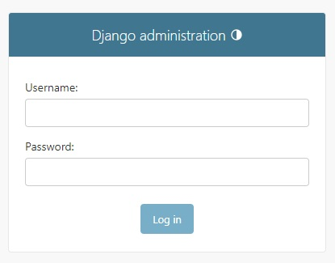

## 1.-Verifico la versión de Python

    python --version
    py --version

    Python 3.10.11

## 2.-Actualizo pip

**pip** es un administrador de paquetes para Python. Los paquetes son módulos de código que se pueden usar en Python. Los paquetes son geniales porque pueden ser compartidos con otros o reutilizados en otros proyectos. Puede instalar paquetes usando pip.

    python -m pip install --upgrade pip
## 2.1.-Verifico la versión de pip

    pip --version

    pip 23.1.2 from C:\Users\fernando\AppData\Local\Programs\Python\Python310\lib\site-packages\pip (python 3.10)

## 3.-Creo el entorno virtual con venv

 El módulo **venv** está incluido en la biblioteca estándar de Python, lo que significa que viene preinstalado con cualquier instalación de Python. Por lo tanto, no necesita instalar nada adicionalmente para utilizar el módulo venv. Puede utilizarlo directamente en su código Python o desde la línea de comandos.

 En mi notebook tengo instaladas las versiones de Python 3.10.11 y 3.8.8, por lo que puedo crear el entorno virtual con cualquiera de las dos versiones.

    C:\Users\fernando\AppData\Local\Programs\Python

Despues de instalar las versiones de Python en Windows, se crean las carpetas `Python310` y `Python38` en la ruta `C:\Users\fernando\AppData\Local\Programs\Python`.  

**IMPORTANTE**: Tengo que verificar las rutas de las variables de usuario `PATH` y de las variables de sistema `Path` para que apunten a la versión de Python que quiero utilizar.

    python -m venv venv
    py -m venv venv

Para crear el entorno con la version que quiero utilizar, ejecuto el siguiente comando:

    C:\Users\fernando\AppData\Local\Programs\Python\Python310\python.exe -m venv venv-3.10.11

    

## 4.-Activo el entorno virtual (venv)

    venv\Scripts\activate

Para activar un entorno especifico

    venv-3.10.11\Scripts\activate

## 4.1-Comandos para instalar y desinstalar paquetes

    pip install
    pip uninstall

## 5.-Instalo Django

Instalar Django después de activar el entorno virtual (venv), ya que de esta manera puede asegurarse de que se instale dentro del entorno virtual y no afecte a otros proyectos o a la instalación global de Python.

Después de activar el entorno virtual `venv`, puedes instalar Django utilizando `pip`. A continuación, se muestra el comando para instalar Django:

```bash
pip install django
```

Este comando instalará la última versión de Django en tu entorno virtual activo. Si deseas instalar una versión específica de Django, puedes especificar la versión junto con el nombre del paquete. Por ejemplo, para instalar Django 3.2, ejecuta:

```bash
pip install django==3.2
```

Una vez que Django esté instalado, podrás verificar la instalación y la versión ejecutando este comando:

```bash
python -m django --version
```

Esto mostrará la versión de Django instalada en tu entorno virtual activo [Source 2](https://roylans.dev/creando-un-entorno-virtual-para-django-framework).

## 5.1.-Comando pip list

    pip list

    Package    Version
    ---------- -------
    asgiref    3.6.0
    Django     4.2.1
    pip        23.1.2
    setuptools 65.5.0
    sqlparse   0.4.4
    tzdata     2023.3

**pip list** es un comando que muestra la lista de paquetes instalados en el entorno virtual activo. Este comando es útil para verificar qué paquetes están instalados en tu entorno de desarrollo, lo que te permite identificar posibles dependencias faltantes o innecesarias.

## 6.-Ejecutar pip freeze > requirements.txt

El comando pip freeze > requirements.txt se utiliza para guardar las dependencias de tu proyecto en un archivo llamado requirements.txt. Es una buena práctica ejecutar este comando después de instalar todas las dependencias iniciales de tu proyecto y cada vez que agregues, actualices o elimines una dependencia.

    pip freeze > requirements.txt

Se crea el archivo `requirements.txt` con las dependencias del proyecto.

    asgiref==3.6.0
    Django==4.2.1
    sqlparse==0.4.4
    tzdata==2023.3

## 7.-Crear un proyecto Django

    django-admin startproject core .

Me crea la carpeta `core` con los archivos necesarios para iniciar el proyecto, y la estructura de carpetas y archivos es la siguiente:

    manage.py
    core
    __init__.py
    asgi.py
    settings.py
    urls.py
    wsgi.py

## 8.-Ejecutar el servidor de desarrollo

    py manage.py runserver

Para cerrar el servidor de desarrollo, presiona

    ctrl + c

## 9.-Crear una aplicación

    py manage.py startapp newapp

Me crea la carpeta `newapp` con los archivos necesarios para iniciar la aplicación, y la estructura de carpetas y archivos es la siguiente:

    newapp
    migrations
    __init__.py
    admin.py
    apps.py
    models.py
    tests.py
    views.py

## 11.-Registrar la aplicación creada 'newapp' en el archivo settings.py de la carpeta core (13)

```python
    INSTALLED_APPS = [
        'django.contrib.admin',
        'django.contrib.auth',
        'django.contrib.contenttypes',
        'django.contrib.sessions',
        'django.contrib.messages',
        'django.contrib.staticfiles',
        'newapp', # Registrar la aplicación creada
    ]
```	

## 12.-Entendiendo Django Request Response Cycle


## 13.-Realizo las migraciones

    You have 18 unapplied migration(s). Your project may not work properly until you apply the migrations for app(s): admin, auth, contenttypes, sessions.

Este aviso indica que tienes 18 migraciones pendientes de aplicar en tu proyecto. Las migraciones son una forma de gestionar los cambios en la estructura de la base de datos a lo largo del tiempo. En este caso, las aplicaciones afectadas son: admin, auth, contenttypes y sessions.

Cuando desarrollas una aplicación que utiliza una base de datos, es común realizar cambios en los modelos (que representan las tablas de la base de datos). Estos cambios pueden incluir la adición o eliminación de campos, la modificación de tipos de datos, la creación de nuevas tablas, entre otros. Las migraciones permiten aplicar estos cambios de manera controlada y consistente en la base de datos.

El aviso sugiere que tu proyecto podría no funcionar correctamente hasta que apliques las migraciones pendientes. Para solucionar este problema, debes aplicar las migraciones utilizando la herramienta de línea de comandos de tu framework. Si estás utilizando Django, por ejemplo, puedes ejecutar el siguiente comando en la terminal:

```
py manage.py migrate
```

Este comando aplicará todas las migraciones pendientes en el orden correcto. Una vez que hayas aplicado las migraciones, tu proyecto debería funcionar correctamente y estar sincronizado con la estructura actual de la base de datos.

Recuerda que es importante mantener un registro de las migraciones y aplicarlas en el entorno de desarrollo, pruebas y producción para garantizar la consistencia y evitar problemas relacionados con la base de datos.

```
(venv-3.10.11) PS D:\....aves-testDjango\testDjango> py manage.py migrate
←[36;1mOperations to perform:←[0m
←[1m  Apply all migrations: ←[0madmin, auth, contenttypes, sessions
←[36;1mRunning migrations:←[0m
  Applying contenttypes.0001_initial...←[32;1m OK←[0m
  Applying auth.0001_initial...←[32;1m OK←[0m
  Applying admin.0001_initial...←[32;1m OK←[0m
  Applying admin.0002_logentry_remove_auto_add...←[32;1m OK←[0m
  Applying admin.0003_logentry_add_action_flag_choices...←[32;1m OK←[0m
  Applying contenttypes.0002_remove_content_type_name...←[32;1m OK←[0m
  Applying auth.0002_alter_permission_name_max_length...←[32;1m OK←[0m
  Applying auth.0003_alter_user_email_max_length...←[32;1m OK←[0m
  Applying auth.0004_alter_user_username_opts...←[32;1m OK←[0m
  Applying auth.0005_alter_user_last_login_null...←[32;1m OK←[0m
  Applying auth.0006_require_contenttypes_0002...←[32;1m OK←[0m
  Applying auth.0007_alter_validators_add_error_messages...←[32;1m OK←[0m
  Applying auth.0008_alter_user_username_max_length...←[32;1m OK←[0m
  Applying auth.0009_alter_user_last_name_max_length...←[32;1m OK←[0m
  Applying auth.0010_alter_group_name_max_length...←[32;1m OK←[0m
  Applying auth.0011_update_proxy_permissions...←[32;1m OK←[0m
  Applying auth.0012_alter_user_first_name_max_length...←[32;1m OK←[0m
  Applying sessions.0001_initial...←[32;1m OK←[0m
(venv-3.10.11) PS D:\....aves-testDjango\testDjango>
```
Ahora ejecuto el servidor

    (venv-3.10.11) PS D:\....aves-testDjango\testDjango> py manage.py runserver
    Watching for file changes with StatReloader
    Performing system checks...

    System check identified no issues (0 silenced).
    May 09, 2023 - 05:33:25
    Django version 4.2.1, using settings 'core.settings'
    Starting development server at http://127.0.0.1:8000/
    Quit the server with CTRL-BREAK.

## 14.-Del archivo urls.py verifico admin.site.urls

Voy al navegador y escribo la siguiente url

    http://127.0.0.1:8000/admin/



**urls.py**: Es una configuración básica de las URL en un proyecto Django que incluye la ruta para el administrador de Django:

```python
from django.contrib import admin
from django.urls import path

urlpatterns = [
    path('admin/', admin.site.urls),
]
```

Este código es parte del archivo `urls.py` en la carpeta principal de tu proyecto Django. Aquí se define la configuración de las URL que se utilizarán en tu aplicación. La configuración es una lista de objetos `path` que definen las rutas y las vistas asociadas a cada ruta.

En este caso, se importan los módulos necesarios:

- `admin` de `django.contrib`: Este módulo es el administrador de Django, que proporciona una interfaz de administración web para gestionar los modelos de tu aplicación.
- `path` de `django.urls`: Esta función se utiliza para definir las rutas de URL en tu aplicación.

La variable `urlpatterns` es una lista que contiene todas las rutas de tu aplicación. En el código proporcionado, solo se ha definido una ruta:

```python
path('admin/', admin.site.urls),
```

Esta ruta define que, cuando se accede a la URL `admin/`, se utilizarán las URL del administrador de Django. La variable `admin.site.urls` es una lista de todas las URL del administrador de Django, que incluye rutas para listar, agregar, editar y eliminar objetos de tus modelos registrados en el administrador.

La configuración básica proporcionada en este código es suficiente para tener un panel de administración de Django funcional en tu aplicación. Si deseas agregar rutas personalizadas o cambiar la ruta del administrador, puedes modificar el archivo `urls.py` según tus necesidades.

Por ejemplo, si deseas cambiar la ruta del administrador a `my_custom_url/`, puedes hacerlo de la siguiente manera:

```python
urlpatterns = [
    path("my_custom_url/", admin.site.urls),
]
```

Esto hará que el panel de administración de Django esté accesible en la URL `my_custom_url/` en lugar de `admin/` [Source 1](https://stackoverflow.com/questions/24162112/custom-url-for-django-admin).

Cambio el nombre a **adminsite/**

```python
from django.contrib import admin
from django.urls import path

urlpatterns = [
    path('adminsite/', admin.site.urls),
]
```
## 15.-Creo una nueva ruta a la newapp

En el archivo **urls.py** de la carpeta **core** importo **include** y agrego la siguiente ruta

```python
from django.contrib import admin
from django.urls import path, include # importo include

urlpatterns = [
    path('adminsite/', admin.site.urls),
    path('', include('newapp.urls')), # ruta para newapp
]
```
## 16.-En la newapp creo un archivo **urls.py**

En la carpeta **newapp** creo un archivo **urls.py** y agrego el siguiente código

```python
from django.urls import path
from . import views # importo las vistas de newapp

urlpatterns = [
    path('', views.home, name='home'),
]
```

## 17.-En el archivo **views.py** de newapp creo las views a traves de la función **home**

Escribo **pass** para que no me de error por el momento

```python
from django.shortcuts import render
from django.http import HttpResponse

# Create your views here.
def home(request):
    return HttpResponse('Hello, World!')
```
